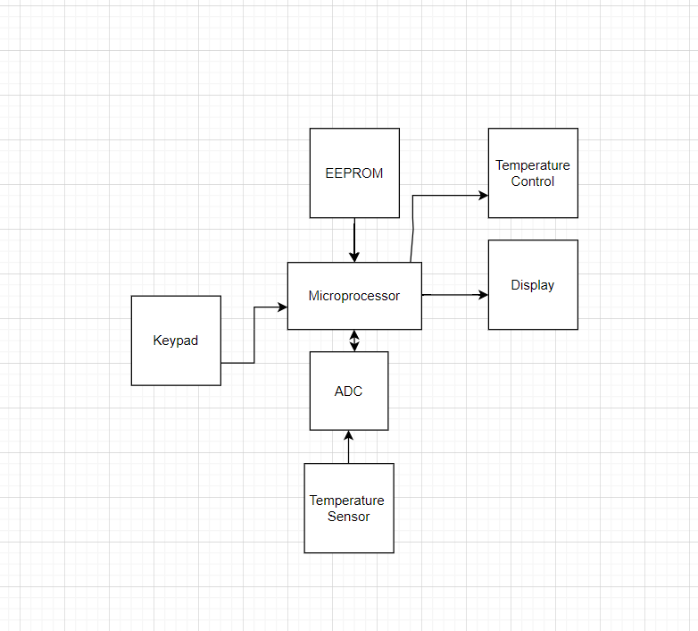

# Case Study 1
* Digital Thermostat

* Microprocessor used is Atmel ATS908535 which is a 8 bit 32 register RISC microcontroller.
* Keypad : Keypad is an input device which is used by the user for entering the temperature according to his convinience.
* Temperature sensor: It detects the surrounding temperature and sends an analogue signal to the ADC.
* ADC : ADC(Analogue to digital converter) is used to convert the analogue output of the temperature sensor to digital input to the microprocessor where it compares the input signal to the user defined temperature and accoringly adjust the temperature.
* EEPROM : Electronically erasable programmable read only memory. 

# Case Study 2