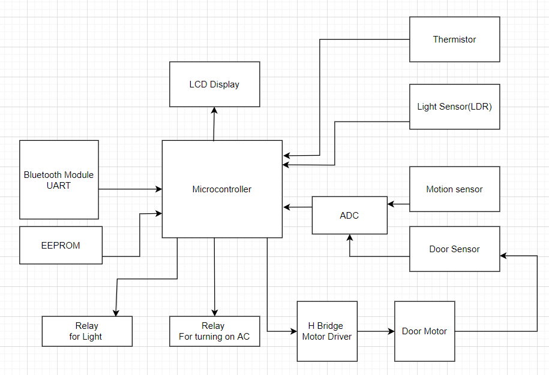
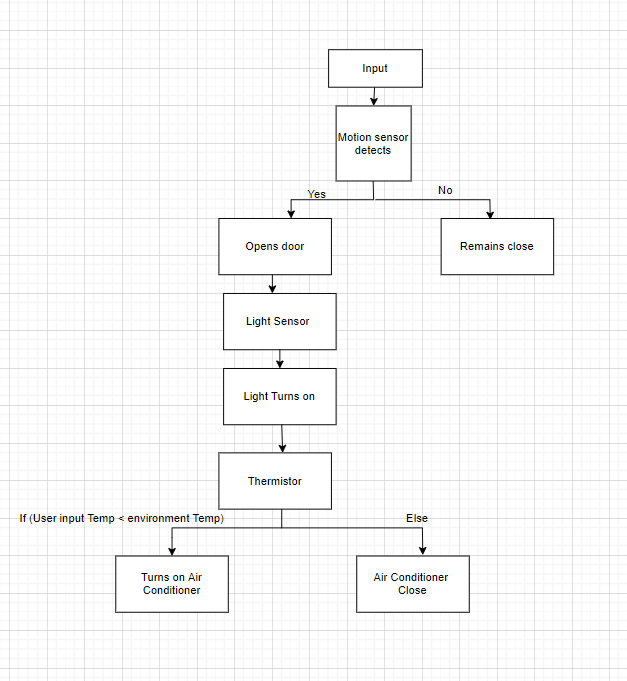

# Smart Home
## Abstract
It is a smart home system, As we know world is going digital and automated it is very necessary we get going with embedded systems more. Whatever automation and software development happening around us is due to embedded systems. And this project is all about embedded systems and the way it makes a individuals or whole mankinds life more easy. In this project bluetooth module is a input device which makes a bridge between user and the microcontroller, user can open the door with the help of bluetooth as soon as he enters the room the lights will get turned on and will also get turned off as soon as he leaves, and AC will also get turned on to the users convinence these all things will be achieved in completion of this project. all this is possible due to microcontrollers, sensors, relays,etc.
## Table Of Contents
* 1 About Smart Home
  * i.   Description
  * ii.  Features
  * iii. SWOT Analysis 
* 2 Requirements
  * i. High Level Requirements
  * ii. Low Level Requirements
* 3 Block diagram and explanation
* 4 Components
* 5 Flow chart and Behavioural Diagram
* 6 Test Plan
* 7 Application
# 1. About Smart Home
 * Description
   
   It is a embedded system where user can control the home appliance using his mobile phone with the help of the bluetooth moduleand sensors will be interfaced with the microcontrollers which will help the microcontroller to attatin the goal of this product.

 * Features :
  
    User will be able to access the appliances using bluetooth and also with the help of sensors and configured by the user the appliances will act accordingly even if user input is not given at that time.

 * SWOT Analysis
  * 5Ws & 1 H
   * Who :

     It is about the embedded system which makes our life easy applying concepts of embedded track and creating an well synced ecosystem.

   * What :
    
     As we are going towards the digital era, everything is becoming automated, literally we dont need to get up from the bed to turn off fan today not only this there are alot of examples of this automation and this gives a good motivation to make something in it. 
  
   * Who :
     As it is a smart home it controls home appliance at one click and with the help of sensors it is for everyone it does not target specific class of people.
   
   * When :

     I will we alone working on this project and at second week of march it will be delivered.

   * Where :

     It will be displayed commercially to make your home a well synced ecosystem, everything will be alligned and furthur development will also be there. 

   * How :
     We will use microcontroller to do this task, programming will be used to interface microcontroller and sensors will be used to get a signals from surrounding and by this our task will be acheived.

# 2. Requirements
## High Level Requirements :

| HLR1  | The AC should turn on after sensing the environment Temperature |
|-------|-----------------------------------------------------------------|
| HLR2  | The door should open when the bluetooth signal is given         | 
| HLR3  | The light must turn off if no one is there                      |
| HLR4  | The user must have the access to the appliance even though he is not at home |

## Low Level Requirements:
|LLR1   | The microcontroller should compare the user input and ambient temp and act accordingly |
|-------|----------------------------------------------------------------------------------------|
|LLR2   | If the user dont wants to turn on light the light must remain off                      |
|LLR3   | If the user doest feel well and dont want to decrease the temp and also not turn on the AC|
|LLR4   | If the user is not himself there but wants the system to open door and turn on lights and turn on AC also for Family member it should be taken care|

# 3. Block Diagram
 * Block diagram of the Smart Home Embedded System
   
   

The Block Diagram explains the various components, sensors, relays and ADC used to construct the Smart Home embedded system and the way it is connected to microcontroller.
* Explanation 

   There are input devices, Actuators, LCD display to show the the room temperature.

   There is a bluetooth module which acts as a input device to the microcintroller from where the motion sensor detects if the user is in front of it and sends an digital input to the ADC (Analog to digital converter) from where it sends an input signal to the microcontroller from where it sends a signal to the H bridge motor and it furthur sends signal to Door motor and it opens the door and the signal is been sent by the door sensor to the microcontroller that the door is opened. As the user enters the room, the light sensor which is an LDR sends an analog signal to the microcontroller and thre microcontroller sends signal to the relay and the light is turned on and at the same time the thermistor senses the temperature in the room, as there is an input device to configure the room temperature by the user. If the temperature detected by the thermistor in the environment is more than the input temperature provided by the user, the microcontroller sends signal to the relay and the relay turns on the air conditioner. If the temperature is less or equal to the user input then the microcontroller doesnt sends signal to the relay which results in no action and Air conditioner stays in idle position.
# 4. Components
## Microcontroller 

  Microcontroller used is ATmega328p it is a high-performance Microchip 8-bit AVR RISC-based microcontroller combines 32 KB ISP Flash memory with read-while-write capabilities, 1024B EEPROM, 2 KB SRAM, 23 general purpose I/O lines, 32 general purpose working registers, three flexible timer/counters with compare modes, internal and external interrupts, serial programmable USART, a byte-oriented Two-Wire serial interface, SPI serial port, a 6-channel 10-bit A/D converter (8-channels in TQFP and QFN/MLF packages), programmable watchdog timer with internal oscillator, and five software selectable power saving modes. The device operates between 1.8-5.5 volts.
## Input Device
* Bluetooth Module
      
    It will act as an input device to the microcontroller or an instrument to make conversation between user and the embedded system. The user will get the chance to configure the settings of the appliance like Air Conditioner, the user will fix a temperature according yo his or her need and the embedded system will act accordinfly.
## Sensors
* Light Sensor :
   
   Light Sensor used is LDR (Light Dependent Resistor) the property of LDR is that it is inversely proportional to the intensity of the surrounding light, when the intensity of light increases the resistance decreases.

   LDR is an analogue output device.

   Light sensor will give a signal which will decide whether to turn on light or not.

* Thermistor
  
  Thermistors are temperature-dependent resistors, changing resistance with changes in temperature. They are very sensitive and react to very small changes in temperature. 

  Thermistor is an analog output device.

  The model used is LM35.

  It will result in turning on or keeping off the AC.

* Motion Sensor
 
  A passive infrared sensor (PIR sensor) is an electronic sensor that measures infrared (IR) light radiating from objects in its field of view. They are most often used in PIR-based motion detectors. 

  PIR sensor detects general movement but does not tell who or what moved.

  PIR sensor is a sensor which gives an digital input device. 

  As it detects the warm temperature of the body and will help to open the door

* Door Sensor 

  A reed switch is used to know wheter the door is open or closed and act accordingly.

## Relays

  A relay is an electrically operated switch. It consists of a set of input terminals for a single or multiple control signals, and a set of operating contact terminals. The switch may have any number of contacts in multiple contact forms, such as make contacts, break contacts, or combinations thereof.

  Relays are used where it is necessary to control a circuit by an independent low-power signal, or where several circuits must be controlled by one signal. Relays were first used in long-distance telegraph circuits as signal repeaters: they refresh the signal coming in from one circuit by transmitting it on another circuit. Relays were used extensively in telephone exchanges and early computers to perform logical operations.

  In our system relays are used to operate light and Air conditioner

## ADC
  
  ADC(Analog Digital Converter) are used to convert the digital signals to the analog.

  As we are using motion sensors and door sensors these are digital output sensor and we cannot give a digital input to the microcontroller so to convert the digital signal to analog signal ADC is used 
## Memory
* EEPROM
  
  EEPROM (Electrically Erasable Programmable Read Only Memory) it is used to store the data from the user.

  It is erasable so new data can be stored in it.

## Half Bridge motor driver:
* An H-bridge is an electronic circuit that switches the polarity of a voltage applied to a load.
* It will help door motor run.
## Door Motor:
* It will open the door for the user.
# Flow chart and Behavioural diuagram

 * Behavioural Diagram of embedded system 

    
 
